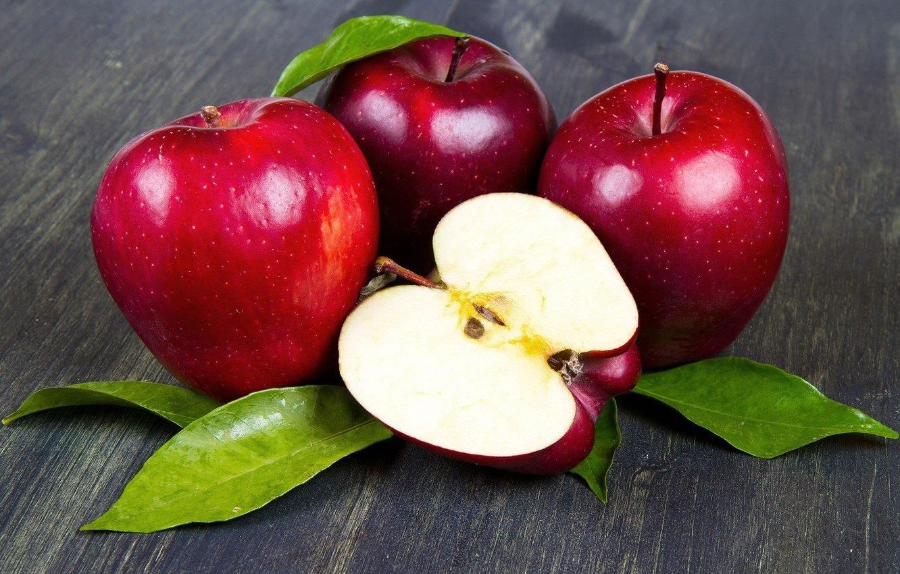
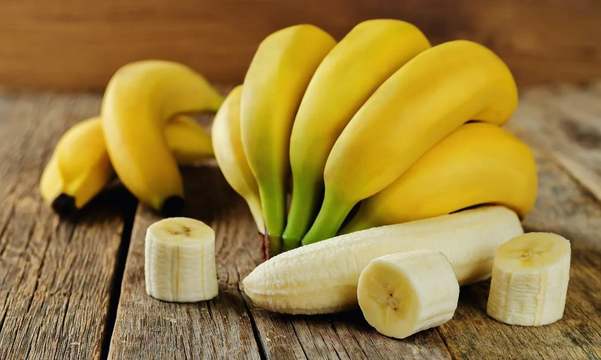
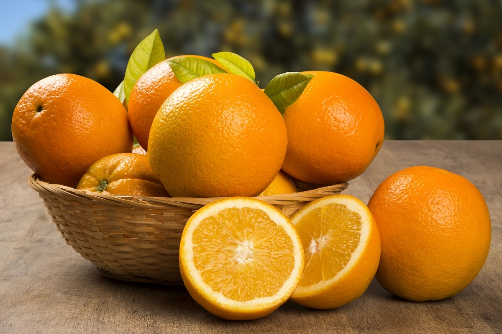
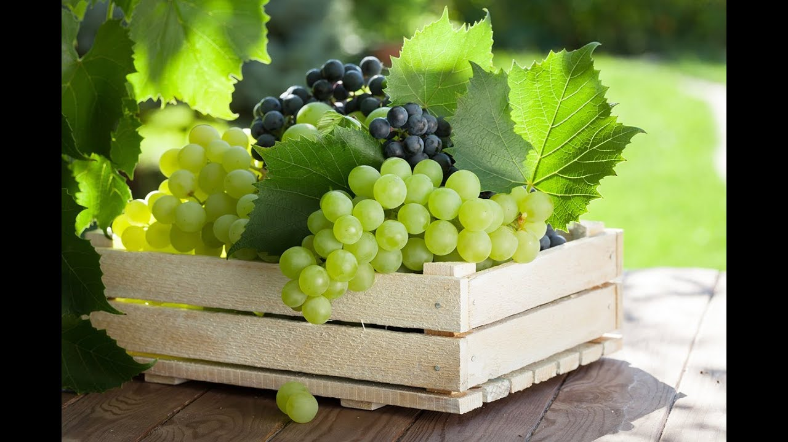
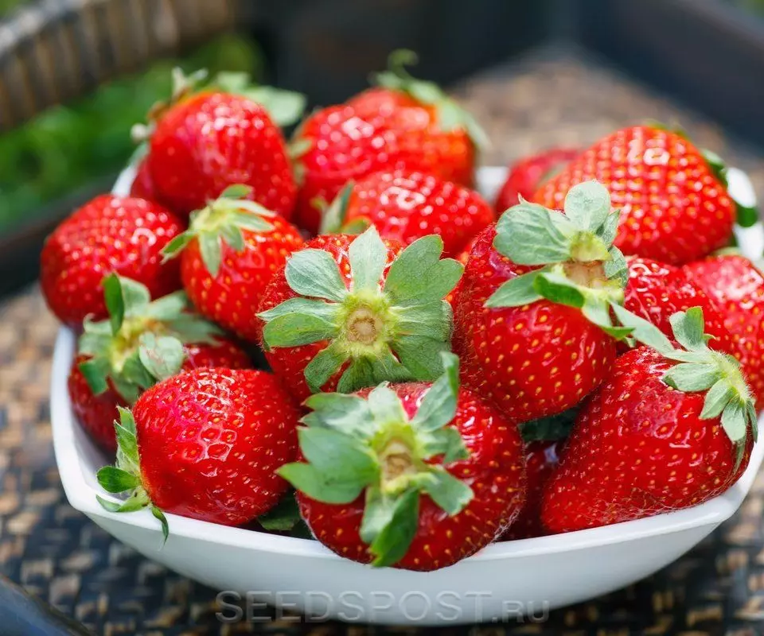

<!DOCTYPE html>
<html lang="en">
<head>
    <meta charset="UTF-8">
    <meta name="viewport" content="width=device-width, initial-scale=1.0">
    <title>Город Фруктов</title>
    
</head>
<body>
    <header>
        <h1>Город Фруктов</h1>
    </header>
    <nav>
        <a href="#home">Home</a>
        <a href="#about">About</a>
        <a href="#contact">Contact</a>
    </nav>
    <main>
        <section id="home">
            <h2 class="section-title">Добро пожаловать в Город Фруктов</h2>
            
Добро пожаловать в "Город Фруктов" - ваш идеальный выбор для свежих и сочных фруктов каждый день!

        </section>
        <section id="about">
            <h2 class="section-title">О нас</h2>
            
"Город Фруктов" - это компания, которая предлагает широкий ассортимент свежих фруктов высочайшего качества. Мы заботимся о том, чтобы каждый клиент получил только самые вкусные и натуральные продукты. Наша миссия - сделать ваш день ярче и вкуснее!

        </section>
        <section id="fruits">
            <h2 class="section-title">Популярные фрукты</h2>
            

                

                    
                    <h3>Яблоки</h3>
                    
150 ₽/кг

                

                

                    
                    <h3>Бананы</h3>
                    
120 ₽/кг

                

                

                    
                    <h3>Апельсины</h3>
                    
200 ₽/кг

                

                

                    
                    <h3>Виноград</h3>
                    
300 ₽/кг

                

                

                    
                    <h3>Клубника</h3>
                    
450 ₽/кг

                

            

        </section>
        <section id="contact">
            <h2 class="section-title">Контакты</h2>
            
Email: <a href="mailto:example@example.com">example@example.com</a>

        </section>
    </main>
    <footer>
        
&copy; 2024 <a href="https://gorodfructov.ru" target="_blank">gorodfructov.ru</a>. Все права защищены.

    </footer>
</body>
</html>
